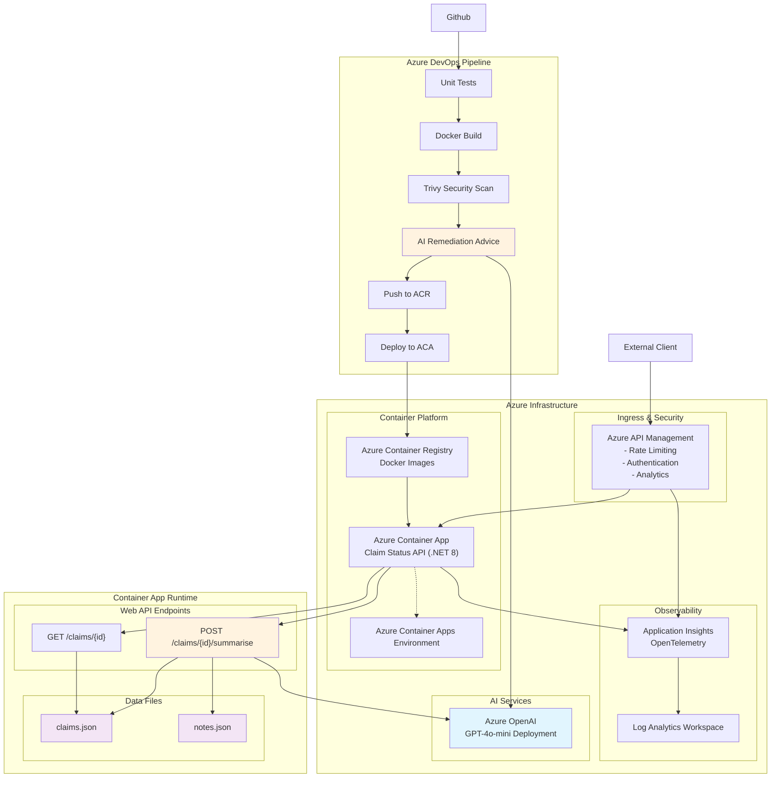

# claim-status-api
A Claim Status API for an academic exercise.

## Repository structure
```

claim-status-api/
├── src/                                    # service source + Dockerfile
│   ├── ClaimStatusAPI/                     # Claim Status API project folder
│   │   ├── Controllers/
│   │   ├── Models/
│   │   ├── mocks/
│   │   │   ├── claims.json                 # 5x claim records
│   │   │   └── notes.json                  # 5x notes blobs
│   │   ├── Dockerfile                      # Dockerfile for Claim Status API
│   │   └── ClaimStatusAPI.csproj
│   └── ClaimStatusAPI.UnitTests            # Claim Status API unit tests project folder
│       └── ClaimStatusAPI.UnitTests.csproj
├── apim/                                   # APIM policy files or export
│   ├── claimstatusapi-swagger.json         # OpenAPI json for APIM deployment
│   └── rate-limit-policy.xml               # APIM rate limit policy definition
├── documentation/                          # auto-generated docs and references
│   ├── auto-generated-adr.md               # GenAI generated Architectural Decision Records
│   └── auto-generated-api-reference.md     # GenAI generated API reference
├── iac/                                    # Az CLI templates
│   ├── provisioned-azure-services.md       # The deployed services
│   ├── create-apim.ps1                     # Deploy APIM instance
│   ├── create-infrastructure.ps1           # Provision core Azure infrastructure
│   ├── setup-apim.ps1                      # Import API spec and configure APIM
│   └── variables.ps1                       # Deployment variables
├── pipelines/
│   ├── azure-pipelines.yml                 # Azure DevOps pipeline
│   └── pipeline-run-complete.md            # Details of pipeline execution
├── scans/                                  # link/screenshots to Defender findings
│   └── security-scans.md                   # Details of security scans
├── observability/                          # saved KQL queries and sample screenshots
│   ├── end-point-tests.md                  # Observed successful application executions
│   ├── end-to-end-correlated-traces.md     # Observed traces and KQL queries
│   ├── failure-responses.md                # Observed failed requests and KQL queries
│   ├── high-latency-traces.md              # Observed high-latency requests and KQL queries
│   └── incident-digests.md                 # GenAI Incident Digests
├── README.md
└── claim-status-api.sln
```

## Architecture

### Conceptual architecture diagram

### Tech stack
|Technology domain|Technology choice|
|--|--|
|Application development framework|C# .net 8.0 (LTS)|
|Application development tools|VS Code|
|Source control|Github|
|Unit test framework|xUnit|
|Test mock frameowk|Moq|
|Containerisation|Docker|
|Cloud platform|Azure|
|Infrastructure provisioning|Powershell|
|Infrastructure deployment and configuration|Az CLI<br/>VS Code Azure API Management Extension|
|Application CI build & deploy pipelines|Azure DevOps|

### Development approach
- Test Driven Development (TDD)
- Spec Driven Development (define a list of tasks in [Tasks.md](Tasks.md) and use GenAI assistance to complete them)

## Service description
### Get claim by id
- Returns a static claim json object populated from claim details in `claims.json` by id

#### Request
|HTTP verb|Path|
|--|--|
|`GET`|`claim/{id}`|

|Parameter|Mandatory|Description|
|--|--|--|
|`id`|TRUE|The id of the claim|

#### Response
```json
{
  "id": "1001",
  "claimNumber": "CLM-1001",
  "policyNumber": "POL-4321",
  "claimant": {
    "firstName": "Alice",
    "lastName": "Martin",
    "phone": "555-0101",
    "email": "alice.martin@example.com"
  },
  "dateOfLoss": "2025-08-01T14:30:00Z",
  "reportedDate": "2025-08-02T09:15:00Z",
  "status": "Open",
  "reserveAmount": 12000,
  "paidAmount": 0,
  "estimatedLoss": 15000,
  "adjusterId": "ADJ-200",
  "description": "Rear-end collision at intersection; claimant reports whiplash and rear bumper damage.",
  "notesRef": "1001"
}
```

### Request claim summary
- Reads claim details in `claims.json` by id
- Reads claim notes in `notes.json` by id
- Submits all claim information to OpenAI for summarisation
- Returns a claim summary json object containing `summary`, `customerSummary`, `adjusterSummary` and `nextSteps` sections.

#### Request
|HTTP verb|Path|
|--|--|
|`POST`|`claim/{id}/summarize`|

|Parameter|Mandatory|Description|
|--|--|--|
|`id`|TRUE|The id of claim to be summarised|

#### Response
```json
{
  "summary": "Claim CLM-1001 involves a rear-end collision reported by claimant Alice Martin, resulting in neck pain and vehicle damage. The initial estimate for vehicle repair is $4,200, while the on-site inspection estimated $6,800 in repairs. The adjuster has set a reserve of $12,000 and is following up on medical outcomes and final repair invoices.",
  "customerSummary": "Alice Martin reported a rear-end collision that occurred on August 1, 2025. She is experiencing neck and lower back pain and has provided documentation including photos and a police report. The vehicle damage has been assessed at approximately $6,800. She has been advised to seek further medical attention if symptoms persist.",
  "adjusterSummary": "Adjuster ADJ-200 has opened the claim, collected necessary documentation, and increased the reserve to cover estimated vehicle repairs and medical expenses following a soft tissue injury diagnosis. The next steps include obtaining a final repair invoice and monitoring the claimant's medical progress.",
  "nextStep": "Follow up with the claimant and the repair shop in 7 days."
}
```
### Auto-generated API reference
> A GenAI-generated API reference can be seen in [auto-generated-api-reference.md](documentation/auto-generated-api-reference.md)

## Infrastructure
Infrastructure provision is handled using `Powershell` scrips in the `/iac/` folder which are run from the command line in the solution root.

### Provisioned infrastructure
> Details of the services that were provisioned in Azure can be seen in [provisioned-azure-services.md](/iac/provisioned-azure-services.md)

### Deployment variables
`.\iac\variables.ps1` defines deployment variables for the deployment.

Increment the `$ATTEMPT_NO` value to reflect the deployment version.

### Deploy infrastructure
From the solution root folder in a Powershell terminal, run:
```bash
.\iac\create-infrastrcuture.ps1
```
This will create all required Azure services ready for app deployment, except an Azure API Management service:

|Resource|Notes|
|--|--|
|Resource group||
|Container Registry||
|Log Analytics Workspace||
|Application Insights||
|Container Apps Environment|OpenTelemetry collection enabled<br/>Integrated with App Insights|
|Container App|Initialised with stock image<br/>Integrated with App Insights<br/>Mapped to Container Registry
|Azure OpenAI|gpt-4o-mini deployed|

### Deploy API Management
APIM creation is kept as a separate script to avoid:
- Long infrastructure creation script running times when creating the rest of the infrastructure
- To avoid unecessary costs in creating APIM before it's required

From the solution root folder in a Powershell terminal, run:
```bash
.\iac\create-apim.ps1
```
This will create an APIM resource at the Developer tier:

|Resource|Notes|
|--|--|
|API Management|Developer tier sku|

### Setup API Management
#### Claims Status API service setup
The Claims Status API is configured on API Managment by updating it with `claimstatusapi-swagger.json` downloaded from the swagger UI when running the service:
```
http://localhost:5017/swagger/v1/swagger.json
```

Run this command from the repo root to create the Claim Status API service:
```
.\iac\setup-apim.ps1
```
The Claim Status API endpoints will be available via APIM:
|Endpoint|APIM URL|
|--|--|
|GET /claims/{id}|https://[apim-name].azure-api.net/v1/Claims/{id}|
|POST /claims/{id}/summarize|https://[apim-name].azure-api.net/v1/Claims/{id}/summarize|

#### Rate limiting policy
A rate limiting policy is defined by `\apim\rate-imit-policy.xml` and applied to APIM to limit the number of calls from a given IP Address to 10 calls in a 60 minute window.

The rate limiting policy cannot be applied to APIM via the `az cli`. Instead the policy must be applied manually, or by using the [VS Code API Management Extension](https://marketplace.visualstudio.com/items?itemName=ms-azuretools.vscode-apimanagement).

Using the APIM Extension, the policy configuration content can be copied from `\apim\rate-imit-policy.xml` and applied to the  `<inbound>` node of the `<policies>` definition XML for the API:
```xml
<policies>
	<inbound>
		<base />
		<rate-limit-by-key calls="10" renewal-period="60" increment-condition="@(context.Response.StatusCode == 200)" counter-key="@(context.Request.IpAddress)" remaining-calls-variable-name="remainingCallsPerIP" />
	</inbound>
	<backend>
		<base />
	</backend>
	<outbound>
		<base />
	</outbound>
	<on-error>
		<base />
	</on-error>
</policies>
```
Updating and saving this file will update APIM in Azure:
```bash
Opening "apimanagement-claimstatusapi-3-claimstatusapi-tempFile.policy.xml"...
Session working folder:5cbe6862e1
Opening "apimanagement-claimstatusapi-3-claimstatusapi-tempFile.policy.xml"...
Updating "apimanagement-claimstatusapi-3-claimstatusapi-tempFile.policy.xml" ...
Updated "apimanagement-claimstatusapi-3-claimstatusapi-tempFile.policy.xml".
```
Exceeding the rate limit will return an `HTTP 429 Too Many Requests` error response:

```json
{
    "statusCode": 429,
    "message": "Rate limit is exceeded. Try again in 50 seconds."
}
```

#### Subscription key auth policy
The policy cannot be applied to APIM via the `az cli` and is enabled by default by APIM.

An `Ocp-Apim-Subscription-Key` header must be present with a valid subscription key value on each request. If this header is not present then the request will receive an `HTTP 401 Unauthorized` response:

```json
{
    "statusCode": 401,
    "message": "Access denied due to a missing application credentials or subscription key. Make sure to include an application token or a subscription key when making requests to the API."
}
```

## DevOps
### Organisation and project
Azure DevOps is used to create an Organisation and a Project to manage the CI pipeline.

### Service connections
The necessary service connections are configured in Azure DevOps to enable connectivity from the DevOps pipeline to Azure resources:

|Connection type|Service connection name|Description|Identity type|
|--|--|--|--|
|ARM service connection|`sc-claimstatusapi-3`|Connection to the Azure Resource Group where infrastructure is deployed|Managed identity|
|Github service connection|`sc-github-chrisabbotthauxwell`|Connection to the Github source code repo|OAuth|
|Docker Registry service connection|`sc-acr-claimstatusai-3`|Connection to Azure ACR|Managed identity|

### Pipeline definition
> Details of the pipeline definition and examples of successful execution can be found in [pipeline-run-complete.md](pipelines/pipeline-run-complete.md).

### Pipeline container image scanning
The CI pipeline is configured with a step to carry out a vulnerability scan of the built Docker image.

> Details of the security scan step outcomes can be found in [security-scans.md](/scans/security-scans.md)

### Defender for Cloud
Defender for Cloud is enabled for the subscription.

> Some details of the Defender for Cloud findings can be found in [security-scans.md](/scans/security-scans.md)

## Observability
### Application Insights, Azure Monitor and trace correlation
APIM cannot be configured for Application Insights and Azure Monitor via `az cli`. This must  be enabled from the Azure Portal in the APIM > APIs > API > Settings section for the deployed API.

Setting the `Correlation protocol` to `W3C` for APIM App Insights enables end-to-end tracing via OpenTelemetry OperationId correlation:

|Component|Configuration|
|--|--|
|APIM|App Insights correlation protocol set to W3C<br/>Sampling set to 100% to capture all traces|
|Container Apps Environment|Sends OpenTelemetry Logs and Traces to Application Insights|
|Container App|Sends application telemetry to Application Insights|
|Application logging|Sends ILogger telemetry to Application Insights<br/>Sends OpenTelemetry application data to Application Insights|

### Observed executions
#### Normal operation
> Evidence of normal operation of the service can be seen in [endpoint-tests.md](/observability/endpoint-tests.md)

> Examples of successful trace observability can be seen in [end-to-end-correlated-traces.md](observability/end-to-end-correlated-traces.md)

#### Anomalous executions
> Examples of failure response observability can be seen in [failure-responses.md](observability/failure-responses.md)

#### Incident Digests
Failied AppRequests logged in Log Analytics were exported and plain English Incident Digest reports were produced for each failure response code.

> Details of the prepared Incident Digests can be seen in [incident-digests.md](observability/incident-digests.md)

## Local execution
### Vanilla .net HTTP service
Build and Run the HTTP WebAPI from the terminal window.

1. Set secrets (see Secrets strategy section)
2. Run application from the ClaimStatusAPI folder:
```
dotnet build
dotnet run
```
3. Access the Swagger UI on http://localhost:5017/swagger.

### Containerised (Docker) service
Build and run the containerised HTTP service from Docker
1. Build new Docker image from repo root
```
docker build -f src/ClaimStatusAPI/Dockerfile -t claimstatusapi:0.0.1 src/ClaimStatusAPI
```
2. Run containerised app passing secrets as environment variables:
```
docker run --rm -e ASPNETCORE_ENVIRONMENT=Development -e AZURE_OPENAI_ENDPOINT="https://<your-endpoint>" -e AZURE_OPENAI_KEY="<your-key>" -e OPENAI_MODEL="gpt-4o-mini" -p 5017:80 claimstatusapi:0.0.1
```
3. Access the Swagger UI on http://localhost:5017/swagger.

## Secrets strategy (local dev, containers/CI, production)

This project uses secrets for Azure OpenAI (endpoint, key, model). Follow the guidance below — never commit secrets to source control.

### 1. Local development - dotnet user-secrets
Required when running the application as a local HTTP service.
- Initialize user-secrets (run in the API project folder):
```powershell
cd src\ClaimStatusAPI
dotnet user-secrets init
dotnet user-secrets set "AzureOpenAI:Endpoint" "https://<your-endpoint>"
dotnet user-secrets set "AzureOpenAI:Key" "<your-key>"
dotnet user-secrets set "AzureOpenAI:Model" "gpt-4o-mini"
```
- Confirm values
```
dotnet user-secrets list
```

### 2. Container local - Environment variables
- Provide secrets as environment variables when running locally with Docker:
```bash
docker run --rm -e ASPNETCORE_ENVIRONMENT=Development -e AZURE_OPENAI_ENDPOINT="https://..." -e AZURE_OPENAI_KEY="..." -e OPENAI_MODEL="gpt-4o-mini" -p 5017:80 claimstatusapi:0.1.0
```

### 3. CI pipeline - Environment variables
- Provide secrets as pipeline secret variables

> See [pipeline-run-complete.md](pipelines/pipeline-run-complete.md) for details of CI pipeline variable and successful pipeline execution.

### 4. Production (Future State) - Azure Key Vault + Managed Identity (best practice)
- Store production secrets in Azure Key Vault and give the container app a managed identity.
- Use Azure Key Vault configuration provider to load secrets into IConfiguration:
```csharp
// Requires Azure.Extensions.AspNetCore.Configuration.Secrets and Azure.Identity
builder.Configuration.AddAzureKeyVault(new Uri("https://<your-vault>.vault.azure.net/"), new DefaultAzureCredential());
```

## Running unit tests
- Restore packages
```
dotnet restore
```
- Run all tests in the solution (from repo root)
```
dotnet test claim-status-api.sln
```
- Run tests for the unit test project only
```
dotnet test src/ClaimStatusAPI.UnitTests/ClaimStatusAPI.UnitTests.csproj
```