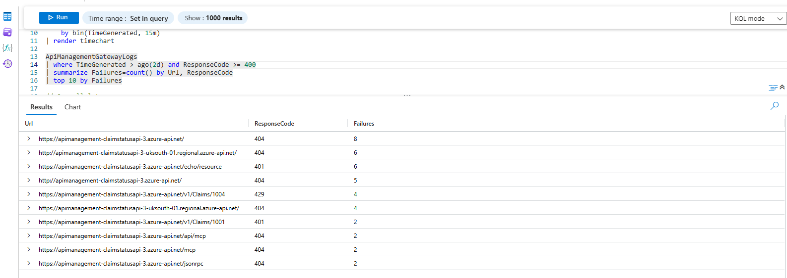

# APIM Logs

## KQL query - top 10 failures
```
ApiManagementGatewayLogs
| where TimeGenerated > ago(2d) and ResponseCode >= 400
| summarize Failures=count() by Url, ResponseCode
| top 10 by Failures
```

### KQL results
