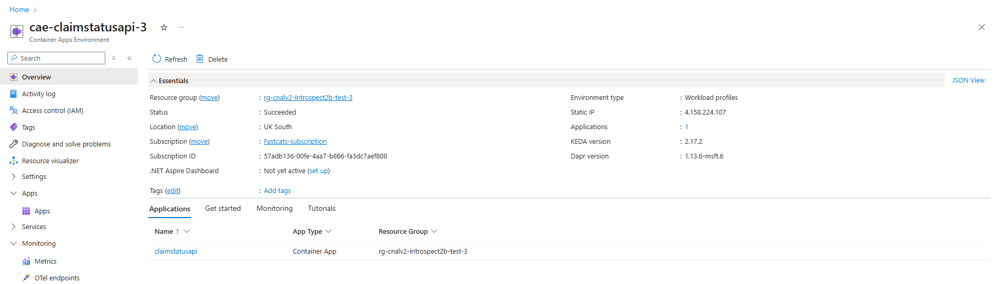

# Provisioned Services
Running the infrastructure deployment scripts deploys the required infrastructure:

|Resource|Notes|
|--|--|
|Resource Group||
|Container Registry||
|Log Analytics Workspace||
|Application Insights||
|Container Apps Environment|OpenTelemetry collection enabled Integrated with App Insights|
|Container App|Initialised with stock image Integrated with App Insights Mapped to Container Registry
|Azure OpenAI|gpt-4o-mini deployed|

## Resource Group

## Container Registry
The provisioned Container Registry showing the `claimstatusapi` Repository

## Log Analytics Workspace
The provisioned Log Analytics Workspace showing the Usage dashboard

## Application Insights
The provisioned Application Insights showing some Performance metrics for dependencies (OpenAI Chat Completion is slow here!)

## Container Apps Environment
The provisioned Container Apps Environment showing the claimstatusapi Container App running and OpenTelemetry endpoint configuration

## Container App
The provisioned Container App showing the deployed and running claimstatusapi image:

## Azure OpenAI
The provisioned OpenAI Service showing the deployed gpt-4o-mini model deployment

## Azure API Management
The provisioned API Management showing the configured Claims Status API endpoints and inbound processing rate limit policy:
