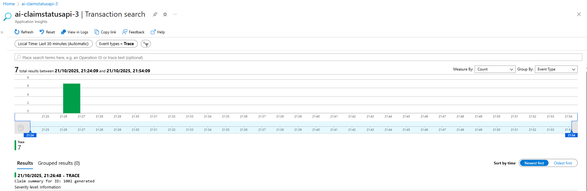
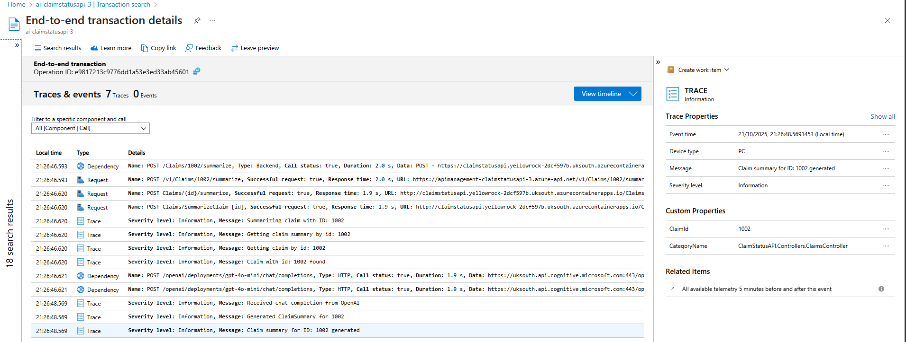
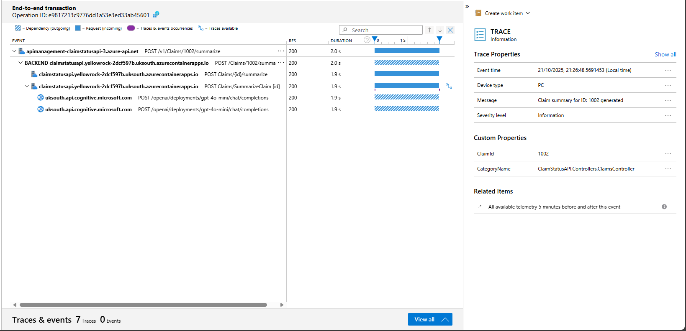
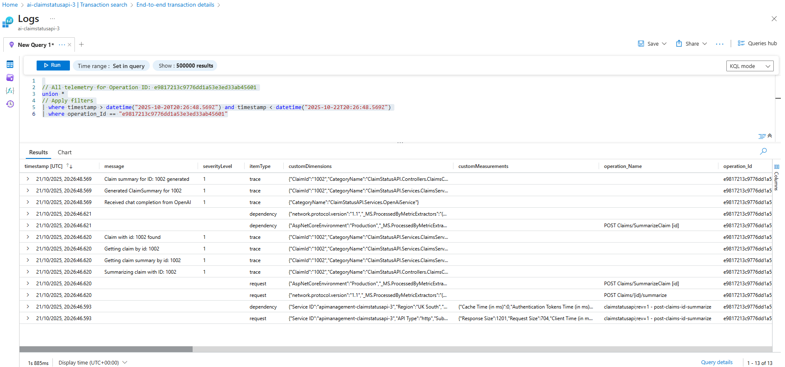

# Correlated tracing

## Tracing configuration
End-to-end correlated tracing is enabled through APIM, Container Apps Environment, Container App and .net application code

|Component|Configuration|
|--|--|
|APIM|App Insights correlation protocol set to W3C|
|Container Apps Environment|Sends OpenTelemetry Logs and Traces to Application Insights|
|Container App|Sends application telemetry to Application Insights|
|Application logging|Sends ILogger telemetry to Application Insights<br/>Sends OpenTelemetry application data to Application Insights|

## Application Insights
Application insights shows end-to-end correlated transaction traces and a timeline, with a claim summary request moving through layers of the solution:

- APIM
  - Container App Backend
    - .NET Application Controller (SummarizeClaim)
      - OpenAI ChatCompletion endpoint

### 1. Application Insights transaction search


### 2. Application Insights traces & events


### 3. Application Insights trace timeline


## KQL query
Telemetry for a transation is corelated by `operation_Id`:
```
// All telemetry for Operation ID: e9817213c9776dd1a53e3ed33ab45601
union *
// Apply filters
| where timestamp > datetime("2025-10-20T20:26:48.569Z") and timestamp < datetime("2025-10-22T20:26:48.569Z")
| where operation_Id == "e9817213c9776dd1a53e3ed33ab45601"
```

### KQL results
