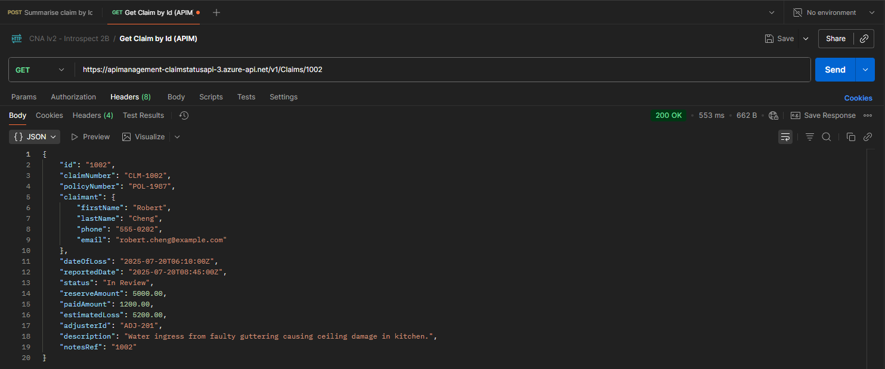
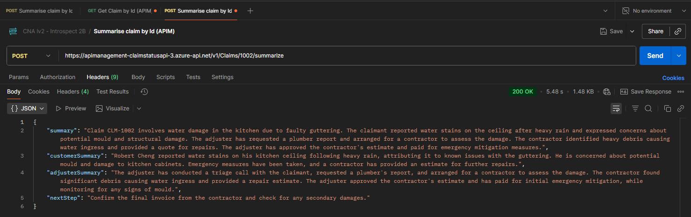

# Endpoint tests
Endpoint testing was carried out using Postman to send HTTP requests to the APIM endpoints and directly to the Container App

## API Management endpoints
### HTTP 200 GET claims/{id}
Calling the GET claim by Id APIM endpoint with a valid subscription key header returns an HTTP 200 response with the correct payload

### HTTP 200 POST claims/{id}/summarize
Calling the POST summarize claim by Id APIM endpoint with a valid subscription key header returns an HTTP 200 response with the correct payload

### 

## Container Apps endpoints
