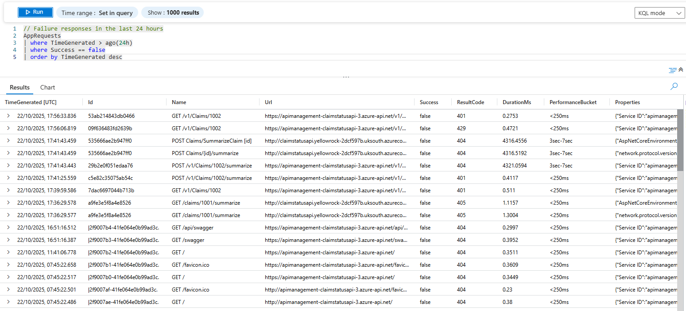

# Failed requests

## Response codes
Various failure response codes can be seen in Log Analytics:

|HTTP Error code|Reason|
|--|--|
|HTTP 429 Too Many Requests|The APIM Rate Limit policy returns HTTP 429 when too many requests are made withing a 60 second window|
|HTTP 401 Unauthorized|The APIM subscription policy returns HTTP 401 when no valid subscription key is present on a request|
|HTTP 404 Not Found|The service returns HTTP 404 when a request is made for a resource which doesn't exist<br/>The service appears to attract a number of unusual requests, including for `GET /favicon.ico`, `GET /jsonrpc` and `GET /v1/mcp`!

### HTTP 429 Too Many Requests
Rapidly requesting the `GET /claims` endpoint from Postman triggers the HTTP 429


These rate limit exceeded traces can be seen in Application Insights transaction and timeline views


## KQL query
Find failed AppRequests:
```
// Failure responses in the last 24 hours
AppRequests
| where TimeGenerated > ago(24h)
| where Success == false
| order by TimeGenerated desc
```

### KQL results
Various failures are recorded for the past 3 hours
