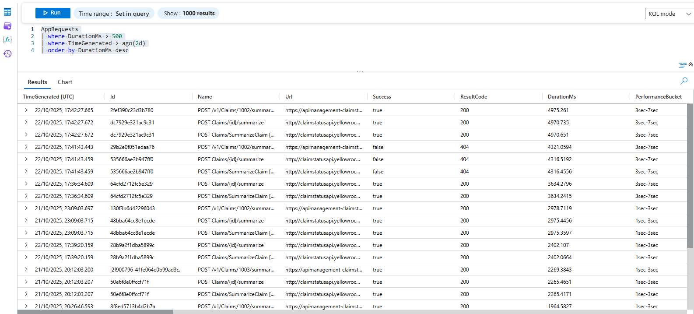

# High Latency Traces

## KQL query
Find requests that took longer than 2000ms to return:
```
AppRequests
| where DurationMs > 2000
| where TimeGenerated > ago(3d)
| order by DurationMs desc
```

### KQL query results


### Incident Digests
High Latency AppRequests logged in Log Analytics were exported and plain English Incident Digest reports were produced.

> Details of the prepared Incident Digests can be seen in [incident-digests-high-latency-requests.md](incident-digests-high-latency-requests.md)