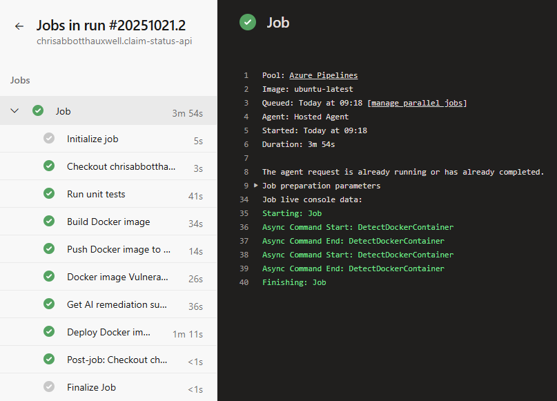
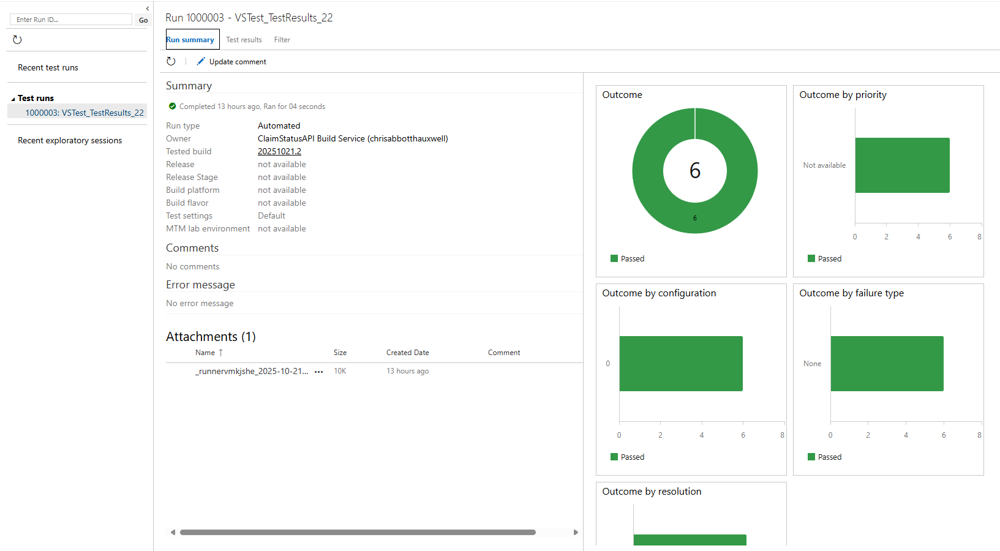

# Pipeline details

## Pipeline steps
The pipeline defined in [azure-pipelines.yml](azure-pipelines.yml) includes the following steps:

|Pipeline step|Purpose|
|--|--|
|`Checkout`|Checkout source code from Github|
|`Run unit tests`|Run all tests in ClaimStatusAPI.UnitTests.csproj|
|`Build Docker image`|Build the Docker image for ClaimStatusAPI.csproj using Dockerfile|
|`Push Docker image to ACR`|Upload the new Docker image to ACR|
|`Docker image Vulnerability scan`|Run a Docker image of Trivy container vulnerability scanner Record CRITICAL and HIGH findings as JSON and print as a table|
|`Get AI remediation suggestions for vulnerabilities`|Send CRITICAL and HIGH findings from Trivy to Azure OpanAI gpt-4o-mini to request remediation suggestions for any vulnerabilities|
|`Deploy Docker image to ACA`|Deploy the newly built and scanned Docker image to ACA|

### Pipeline variables
Azure DevOps pipeline variables are configured and used by the "Get AI remediation suggestions for vulnerabilities" and "Deploy Docker image to ACA" steps

|Pipeline variable|Variable type|Purpose|
|--|--|--|
|`OPENAI_MODEL`|Pipeline variable|Deployed model name|
|`AZURE_OPENAI_ENDPOINT`|Pipeline secret|The HTTP endpoint of the deployed model|
|`AZURE_OPENAI_KEY`|Pipeline secret|The access key for the deployed model|

### Completed pipeline execution

### Unit test results

### Vulnerability scanning and GenAI remediation
> Docker image vulnerability scanning and GenAI-based remediation is discussed in [security-scans.md](../scans/security-scans.md)