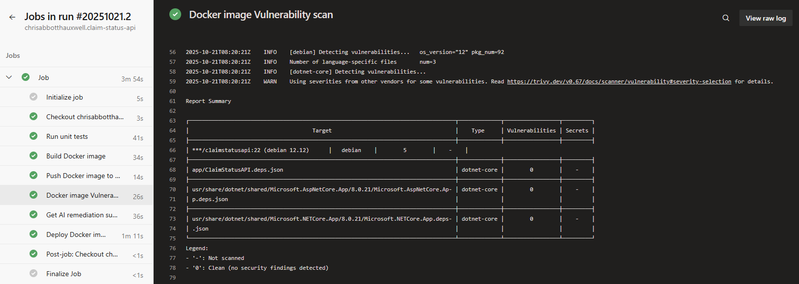
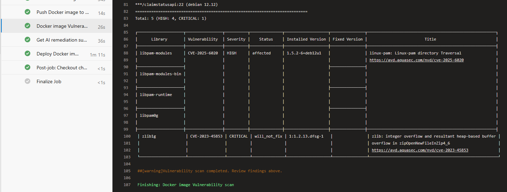
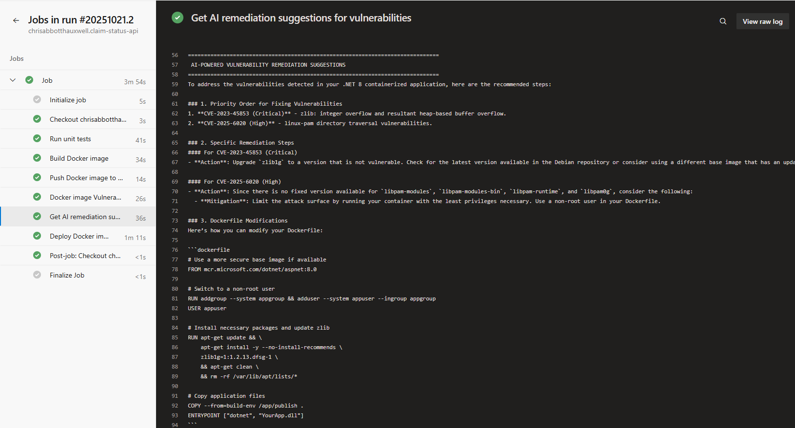
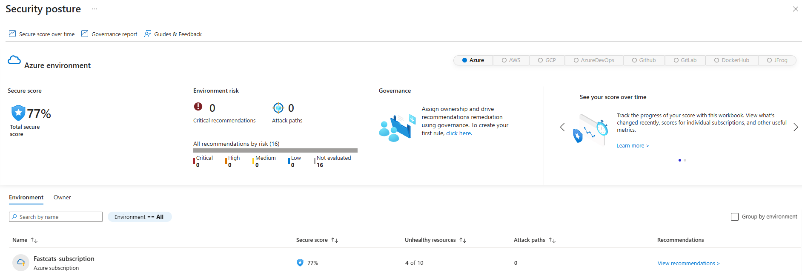
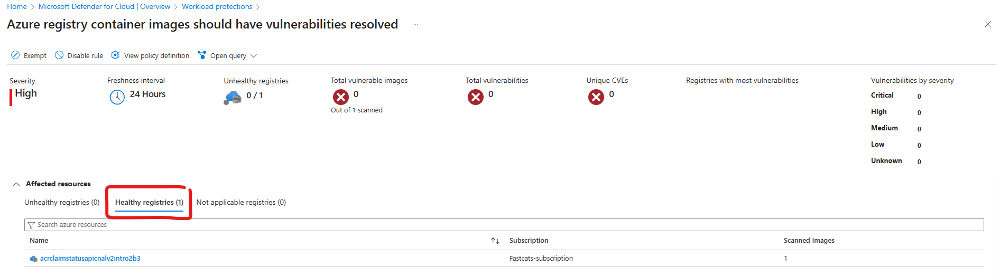
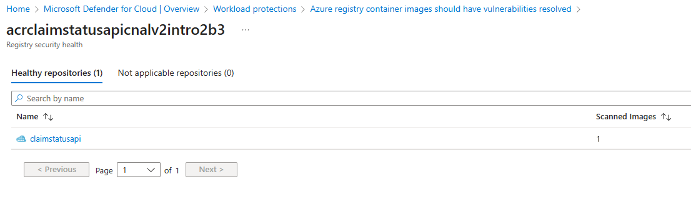
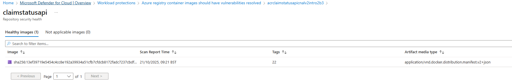

# Docker container image security scanning

## In-pipeline vulnerability scanning with Aquesecurity Trivy
The [pipeline](../pipelines/pipeline-run-complete.md) step `Docker image Vulnerability scan` carries out the following tasks:

1. Run [Aquasecurity's Trivy](https://github.com/aquasecurity/trivy) as a Docker image to scan the Claim Status API Docker image for CRITICAL and HIGH severity and save them in the build agent workspace as `trivy-results.json`
2. Format the CRITICAL and HIGH severity findings as a table and render them in the pipeline logs

### Why use Trivy?
Trivy was implemented because Defender for Cloud does not provide realtime Docker image scanning. Instead image scanning could take several hours.

In order to integrate Defender for Cloud in the pipeline to check the produced image for vulnerabilities, a polling loop would be needed to check for a completed image scan.

This would be very slow.

Instead Trivy was integrated for realtime pipeline Docker image vulnerability scanning.

### Fail on error vs warning
In the interest of producing a working pipeline, I decided it was more interesting to **log the errors as warnings** and allow building of the image to complete for this exercise.

### Trivy Results
Trivy detected 5x vulnerabilities in the Docker image that was produced:





## GenAI remediation suggestions
The [pipeline](../pipelines/pipeline-run-complete.md) step `Get AI remediation suggestions for vulnerabilities` carries out the following tasks:

1. Check for existence of `trivy-results.json` and extract the top 10 CRITICAL and HIGH vulnerabilities (for token efficiency)
2. Add the Trivy results to a prompt template to request remediation suggestions
3. Send the prompt to OpenAI chat completion endpoint
4. Add the prioritised remediation suggestions to the pipeline log output

### Prompt template
The `$vuln_summary` placeholder is replaced with the top 10 vulnerabilities in `trivy-results.json` before the prompt is send to OpenAI.

> "You are a security expert. I have a .NET 8 containerized application with the following vulnerabilities detected by Trivy. Please provide specific, actionable remediation steps:
>
> Container Image: `$(acrLoginServer)/$(imageRepository):$(tag)`
>
> Base Image: `mcr.microsoft.com/dotnet/aspnet:8.0`
> 
> Vulnerabilities:
> `$vuln_summary`
> 
> Please provide:
> 1. Priority order for fixing these vulnerabilities
> 2. Specific remediation steps (package updates, base image changes, etc.)
> 3. Any Dockerfile modifications needed
> 4. Alternative approaches if direct fixes aren't available
> 
> Keep the response concise and actionable for a CI/CD pipeline context."

### OpenAI remediation results
The OpenAI results are logged to the pipeline output. A typical response is shown below:



```
==============================================================================
 AI-POWERED VULNERABILITY REMEDIATION SUGGESTIONS
==============================================================================
To address the vulnerabilities detected in your .NET 8 containerized application, here are the recommended steps:

### 1. Priority Order for Fixing Vulnerabilities
1. **CVE-2023-45853 (Critical)** - zlib: integer overflow and resultant heap-based buffer overflow.
2. **CVE-2025-6020 (High)** - linux-pam directory traversal vulnerabilities.

### 2. Specific Remediation Steps
#### For CVE-2023-45853 (Critical)
- **Action**: Upgrade `zlib1g` to a version that is not vulnerable. Check for the latest version available in the Debian repository or consider using a different base image that has an updated version of `zlib`.
  
#### For CVE-2025-6020 (High)
- **Action**: Since there is no fixed version available for `libpam-modules`, `libpam-modules-bin`, `libpam-runtime`, and `libpam0g`, consider the following:
  - **Mitigation**: Limit the attack surface by running your container with the least privileges necessary. Use a non-root user in your Dockerfile.

### 3. Dockerfile Modifications
Here’s how you can modify your Dockerfile:

dockerfile
# Use a more secure base image if available
FROM mcr.microsoft.com/dotnet/aspnet:8.0

# Switch to a non-root user
RUN addgroup --system appgroup && adduser --system appuser --ingroup appgroup
USER appuser

# Install necessary packages and update zlib
RUN apt-get update && \
    apt-get install -y --no-install-recommends \
    zlib1g=1:1.2.13.dfsg-1 \
    && apt-get clean \
    && rm -rf /var/lib/apt/lists/*

# Copy application files
COPY --from=build-env /app/publish .
ENTRYPOINT ["dotnet", "YourApp.dll"]


### 4. Alternative Approaches if Direct Fixes Aren't Available
- **Use a Different Base Image**: If the vulnerabilities persist and no fixed versions are available, consider using a different base image that is actively maintained and has the required packages updated.
- **Container Hardening**: Implement security best practices such as:
  - Running containers with the `--read-only` flag.
  - Using seccomp, AppArmor, or SELinux profiles to limit container capabilities.
  - Regularly scanning your images with tools like Trivy to catch vulnerabilities early.

### CI/CD Pipeline Context
- Integrate vulnerability scanning in your CI/CD pipeline to catch vulnerabilities before deployment.
- Automate the rebuilding of images with updated dependencies and base images as part of your CI/CD process.

By following these steps, you can effectively mitigate the identified vulnerabilities in your .NET 8 containerized application.
==============================================================================
```

## Defender for Cloud
Defender for Cloud has been enabled on the subscription to enable Defender for Containers and to establish a Security Posture.

The results are not as useful as the Trivy results.

### Security Posture
Defender CSPM is not enabled (on cost grounds) so only summary Security Posture information is available:



### Defender for Containers
Defender for Containers reports that there are no Unhealthy registries


Defender for Containers shows that ACR contains one healthy image:


Defender for Containers shows that the ClaimStatusAPI image is healthy:
